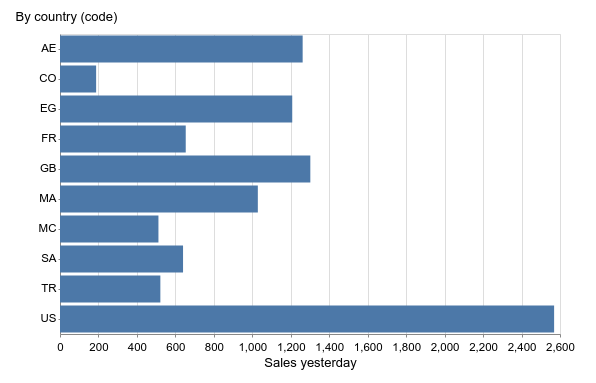

---

title: Au rapport chef !
author: Jérôme Carré
keywords: elasticsearch, vega-lite, markdown, marktext

---

## Genèse

Les émissions culinaires sont très à la mode : "et si je mélangeais des huîtres avec du caramel ça devrait être bon ..." beurk ! C'est de ce type d'idée bizarre qu'est naît cet article : "Si je mets des data `Elasticsearch` dans un diagramme `vega-lite`, dans un bloc de code `Markdown` ça devrait être ~~bon~~ pros !"

L'idée a aussi était inspirée d'un outil : [Marktext](https://marktext.app/). C'est un éditeur wysiwyg de `Markdown` qui sait interpréter en live le `vega-lite` ! Il est gratuit, opensource et multi-plateforme (c'est de l'electron) ! Il peut aussi faire des exports en PDF des diagrammes `vega-lite`.

## Les bases

Un petit rappel des outils que l'on va mettre en œuvre :

**Elasticsearch** :

**Markdown** :

**Vega-lite** :

## A l'origine ... les data

Pour avoir une situation de reporting réaliste, on doit avoir des données représentatives d'une activité métier.  `Elastic Stack` fournit justement des données de démonstration pour cela : d'e-commerce, de navigation aérienne, de trafic web. On choisira les données d'e-commerce. Chaque enregistrement trace l'achat d'un consommateur, avec les produits achetés, la localisation de l'acheteur...

Une requête intéressante à afficher serait : le montant des ventes d'hier par pays.

 On prépare donc une belle requête elasticsearch pour que les données arrivent pré-traitées dans `vega-lite` :

```json
POST _sql?format=csv
{
  "query": "SELECT SUM(taxful_total_price) AS total_price, geoip.country_iso_code AS country 	FROM kibana_sample_data_ecommerce GROUP bY geoip.country_iso_code ORDER BY count",
  "filter": { "range": {
            	"order_date": {
                	"gte" : "now-2d/d",
                	"lte" : "now-1d/d"
} } } }
```

> On choisit d'utiliser l'API SQL car elle permet de simplifier l'écriture de la requête et de choisir le format de sortie (ex: CSV).

Il ne reste plus qu'à mettre cette URL et sa payload dans la partie data de `vega-lite` ... **Échec** !! `vega-lite` ne permet pas de passer une payload ni de choisir le verbe http ... on ne peut passer qu'une simple URL !

Pour dépasser cette limitation, nous avons deux possibilités :

1. on transforme les données dans `Elasticsearch`
2. on manipule les données dans `vega-lite`

Nous allons explorer les deux solutions.

### Transformation !!

Depuis la version 7.2, `Elasticsearch` propose l'API *[transform](https://www.elastic.co/guide/en/elasticsearch/reference/current/transform-apis.html)*. Elle permet de transformer, regrouper des données à la volée (ou en batch) et de les stocker dans un nouvel index. Nous n'aurons plus qu'à interroger ce nouvel index avec une simple requête et le tour est joué. Les *transform* peuvent être manipulés par API ou par un écran dans Kibana.

Dans notre cas, on va utiliser *transform* pour faire la somme des achats par pays par jour :

```json
PUT _transform/ecommerce_by_day
{
  "source": {
    "index": [ "kibana_sample_data_ecommerce" ],
    "query": { "match_all": {} }
  },
  "dest": { "index": "transform_kibana_sample_data_ecommerce" },
  "pivot": {
    "group_by": {
      "country_iso_code": {
        "terms": { "field": "geoip.country_iso_code" }
      },
      "order_date": {
        "date_histogram": { "field": "order_date", "calendar_interval": "1d" }
      }
    },
    "aggregations": {
      "taxful_price_sum": {
        "sum": { "field": "products.taxful_price" }
      }
    }
  }
}
```

Une fois créée, il faut lancer la transformation :

```json
POST _transform/ecommerce_by_day/_start
```

Et maintenant en une seule requête nous obtenons notre jeu de données pré-calculé :

```shell
GET transform_kibana_sample_data_ecommerce/_search?q="order_date:>now-2d+AND+order_date:<now-1d"
```

> Il faut juste préciser que l'on ne veut que les données d'hier.

### Manipulation

Si vous ne voulez pas utiliser les *transform* ou si votre version d’Elasticsearch ne le permet pas, il ne vous reste plus qu'à manipuler les données dans `vega-lite`.

Le principe est qu'on récupère les données brutes en entrée et ensuite on applique des transformations. Pour ne pas charger toute les données on limitera la période de temps des données, ce qui se fait facilement en une seule requête (voir requête lancée sur la transformation).

On va commencer par voir comment déclarer des données dans `vega-lite`:

```json
"data": {
  "url": "http://elasticsearch:9200/kibana_sample_data_ecommerce/_search?q=order_date:>now-2d+AND+order_date:<now-1d",
  "format": {
    "type": "json",
    "property": "hits.hits"
}
```

> * une *url* contenant notre requête simple
> * un bloc *format* permettant de préciser le *type* des données (json pour nous)  et la racine des données : *hits.hits* dans les résultats `Elasticsearch`.

On fait l'hypothèse que les données remontées ne concernent que la journée d'hier. 

On va donc pour simplement préciser que sur l'axe numérique (des montants) on veut faire une somme qui sera forcément corrélées à l'autre axe (des villes) :

```json
  "encoding": {
    "x": {
      "field": "_source.taxful_total_price",
      "aggregate": "sum",
      "type": "quantitative",
    },
    "y": {
      "field": "_source.geoip.country_iso_code",
      "type": "ordinal",
    }
  }
```

> les donnés sont disponibles dans le bloc *_source*

Ça parait plus simple mais l'agrégation est très simple ici. Dans la suite de l'article on priviligiera la solution à base de *transform* `elasticsearch`.

## Ooooh la belle courbe

Pour le type de rapport que l'on veut présenter (le montant des ventes d'hier par pays), on se tournerait naturellement vers une représentation en camembert ou donut (si vous plus sucré que salé). Dans `vega-lite` cela s'appelle *arc*. Et ce n'est bizarrement disponible que depuis la version 4.9 (avril 2020) et ... `marktext` n'est qu'en version 4.7 => **Échec pas de représentation en camembert !**

Et bien on choisira une représentation en barres horizontales (*bar* en `vega-lite`).

```json
{
  "data": {
    "url": "http://elasticsearch:9200/transform_kibana_sample_data_ecommerce/_search?q=order_date:<now-1d+AND+order_date:>=now-2d",
    "format": {
      "type": "json",
      "property": "hits.hits"
    }
  },
  "mark": "bar",
  "encoding": {
    "x": {
      "field": "_source.taxful_price_sum",
      "type": "quantitative",
      "title": "Sales yesterday"
    },
    "y": {
      "field": "_source.country_iso_code",
      "type": "ordinal",
      "title": "By country (code)"
    }
  }
}
```

TADAAAAM !!




## Au rapport chef !!

La markdown dans marktext

export

asciidoctor

## Limitations

URL single line => authent ?